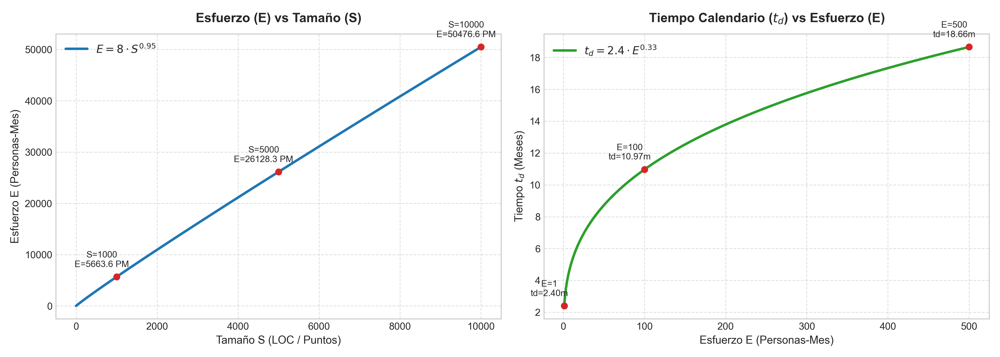
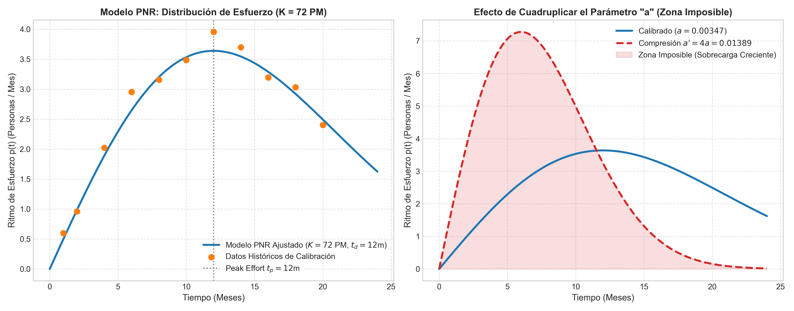
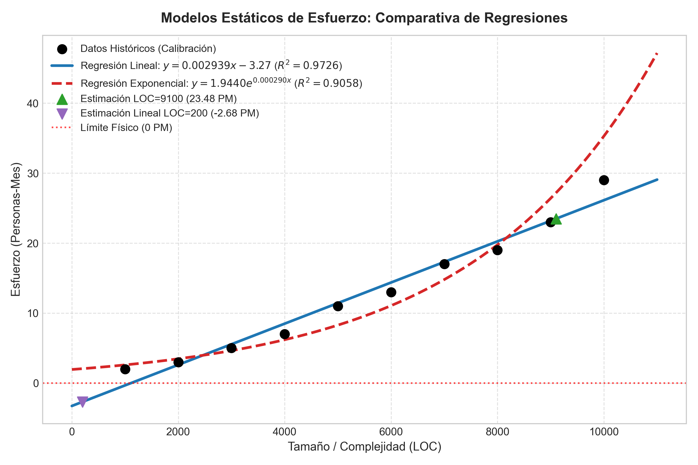

# TP9: Administración de Proyectos (Planificación)

**Asignatura:** Ingeniería de Software II  
**Docente:** Dr. Pedro E. Colla  
**Institución:** Facultad de Ciencia y Tecnología (FCyT) - Universidad Autónoma de Entre Ríos (UADER)  
**Ubicación de Resolución y Documentación:** `src/tp9/`

> **Nota de Alineación Académica:** Las respuestas y análisis presentados en este documento han sido elaborados en estricta conformidad con el marco teórico, modelos sistémicos, fórmulas y láminas de las clases dictadas por el **Dr. Pedro E. Colla** (*"Planificación del Alcance"*, *"Administración de Proyectos: Introducción y Conceptos"*, y talleres asociados).

---

## Tabla de Contenidos

1. [Ejercicio 1: Mantenimiento de Sistemas como Proyecto](#ejercicio-1-mantenimiento-de-sistemas-como-proyecto)
2. [Ejercicio 2: Programas vs. Proyectos](#ejercicio-2-programas-vs-proyectos)
3. [Ejercicio 3: Restricciones Arbitrarias y el Triángulo de Hierro](#ejercicio-3-restricciones-arbitrarias-y-el-triangulo-de-hierro)
4. [Ejercicio 4: Script de Estimación de Esfuerzo y Tiempo Calendario](#ejercicio-4-script-de-estimacion-de-esfuerzo-y-tiempo-calendario)
5. [Ejercicio 5: Priorización de Backlog y Evaluación de Capacidad](#ejercicio-5-priorizacion-de-backlog-y-evaluacion-de-capacidad)
6. [Ejercicio 6: Resumen Artículo "What Do Software Developers Need to Know about Business"](#ejercicio-6-resumen-articulo-what-do-software-developers-need-to-know-about-business)
7. [Ejercicio 7: Resumen Artículo "Subjective Consistency"](#ejercicio-7-resumen-articulo-subjective-consistency)
8. [Ejercicio 8: Modelo Dinámico PNR (Putnam-Norden-Rayleigh) y Zona Imposible](#ejercicio-8-modelo-dinamico-pnr-putnam-norden-rayleigh-y-zona-imposible)
9. [Ejercicio 9: Modelos Estáticos de Regresión para Estimación de Esfuerzo](#ejercicio-9-modelos-estaticos-de-regresion-para-estimacion-de-esfuerzo)
10. [Ejercicio 10: Evaluación en Etapas y Teoría de Opciones Reales](#ejercicio-10-evaluacion-en-etapas-y-teoria-de-opciones-reales)
11. [Ejercicio 11: Contabilidad Devengada vs. Gestión Financiera de Liquidez](#ejercicio-11-contabilidad-devengada-vs-gestion-financiera-de-liquidez)
12. [Ejercicio 12: Regímenes de Promoción Impositiva y Apalancamiento](#ejercicio-12-regimenes-de-promocion-impositiva-y-apalancamiento)
13. [Ejercicio 13: Variaciones de Estimación y Reservas de Contingencia](#ejercicio-13-variaciones-de-estimacion-y-reservas-de-contingencia)
14. [Ejercicio 14: Esperanza Matemática en Ruleta](#ejercicio-14-esperanza-matematica-en-ruleta)
15. [Ejercicio 15: Telar de los Colores (Esquema Ponzi)](#ejercicio-15-telar-de-los-colores-esquema-ponzi)
16. [Ejercicio 16: Cálculo de Valor Presente (VP)](#ejercicio-16-calculo-de-valor-presente-vp)
17. [Ejercicio 17: Tasa Efectiva Anual (TEA) e Impacto en Camino Crítico](#ejercicio-17-tasa-efectiva-anual-tea-e-impacto-en-camino-critico)

---

## Ejercicio 1: Mantenimiento de Sistemas como Proyecto

### Pregunta:
Asumiendo que el mantenimiento de un sistema es una tarea continua. ¿Puede ser considerado como un proyecto? ¿Qué características deben asignarse a las tareas de mantenimiento para poder ser, efectivamente, considerada un proyecto?

### Resolución conforme a la teoría del Dr. Pedro E. Colla:
De acuerdo con las definiciones vertidas en la materia (Lámina 12 de *Introducción y Conceptos* y Lámina 44 de *Planificación del Alcance*):
- Un **proyecto** se define como *"un esfuerzo temporal emprendido para crear o modificar un producto o servicio específico, con un inicio y un fin claros"* (PMI-PMBOK, IEEE).
- El **mantenimiento continuo** (*Mantenimiento MOL / Soporte Producción*), por su naturaleza, tiende a ser una operación continua (*Business As Usual*) con cadenas de precedencia más cortas y un nivel de staff constante gobernado por restricciones organizacionales.

Para que las tareas de mantenimiento se adopten **efectivamente como un proyecto**, deben paquetizarse asignándoles las siguientes características de gestión:

1. **Definición de Límites Temporales Fijos ($\tau$):** Delimitar explícitamente ventanas temporales cerradas (ej. un paquete de lanzamientos de 6 a 12 semanas o un conjunto acotado de sprints).
2. **Alcance Delimitado y Cerrado ($F_r$):** Congelar la lista de Funciones Requeridas ($F_r$), historias de usuario o solicitudes de cambio (CRs), evitando la alteración continua del alcance sin control de cambios.
3. **Restricción Presupuestaria y de Recursos Fijos ($P$ / Staff):** Asignar una capacidad fija de personas-mes (PM) o story points por sprint. Tal como señala el Dr. Colla (Lámina 46), en mantenimiento se acepta que **los recursos y el calendario están fijos y se gestiona mediante la funcionalidad** (Alcance variable).
4. **Criterios de Calidad y Retrabajo Acotados ($PCE$ / Deuda Técnica):** Establecer metas explícitas de calidad (Porcentaje de Calidad $PCE$) para controlar que la generación de deuda técnica involuntaria no consuma la capacidad operativa.

---

## Ejercicio 2: Programas vs. Proyectos

### Pregunta:
¿Cuál es el motivo conceptual por la cual ciertas iniciativas se estructuran como programas en vez de proyectos?

### Resolución conforme a la teoría del Dr. Pedro E. Colla:
Siguiendo la definición expresada en las láminas del curso (Lámina 23 de *Introducción y Conceptos*):

> *"La complejidad de un proyecto no aumenta linealmente con el tamaño. Un programa es un grupo coordinado de proyectos, mayormente diferenciado por una escala superior, típicamente más extenso funcional o temporalmente y asociado a un producto o servicio integral."*

El **motivo conceptual determinante** para estructurar iniciativas como **programas** comprende:
- **Gestión de la Complejidad No Lineal:** Al crecer la escala (proyectos $\ge 500 \text{ PM}$), dividirlos en subproyectos coordinados evita el colapso por fricción de comunicación y coordinación.
- **Alineación con la Propuesta de Valor Estratégica:** Los programas permiten gestionar la interdependencia entre proyectos de producto (técnicos) y proyectos de proceso (gestión), garantizando la entrega acumulada de valor económico y financiero.
- **Balance y Transfusión de Recursos:** Facilita la asignación dinámica de capacidades y licencias compartidas entre subproyectos paralelos.

---

## Ejercicio 3: Restricciones Arbitrarias y el Triángulo de Hierro

### Pregunta:
Asumiendo como válida la premisa que la definición de las características de un proyecto viene dada por las elecciones de los parámetros de Tiempo (Calendario), Recursos (Costo), Requerimientos (Funciones) y Calidad (Defectos). ¿Cuál cree pueda ser el efecto de fijar arbitrariamente Tiempo, Recursos y Requerimientos a valores de conveniencia para el proyecto?

### Resolución conforme a la teoría del Dr. Pedro E. Colla:
En el **Modelo Sistémico del Proyecto** (Láminas 2 y 16 de *Modelo Sistémico* y Láminas 38, 41 y 45 de *Planificación del Alcance*):
- El proyecto satisface una relación sistémica $E = \pi S^\alpha$, $\tau = \kappa E^\beta$, y un equilibrio financiero $\mathbf{\text{Costo} \le \text{Precio} \le \text{Valor}}$.

Si la gerencia o el cliente fijan **arbitrariamente a valores de conveniencia** el Tiempo ($\tau$), los Recursos/Costo ($E$) y los Requerimientos/Tamaño ($S$):

1. **La Calidad y la Deuda Técnica sufren el Ajuste Implícito:** Como lo formula expresamente el Dr. Colla (Lámina 45):  
   > *"Los defectos son deuda técnica y los desvíos son en presupuesto."*  
   Al congelar tiempo, costo y funciones, la única variable libre del sistema para absorber la tensión es la **Calidad ($D = \delta S$)**, desatando una acumulación crítica de defectos y retrasos por retrabajo ($E_{CoPQ} = \mu D$).
2. **Entrada Forzada en la "Zona Imposible":** Intentar reducir el calendario ($\tau$) agregando recursos en forma no proporcional conduce a la **Zona Imposible** (Láminas 26, 39, 41 y 42). Boehm demostró empíricamente que el límite práctico para comprimir el tiempo con recursos adicionales es de apenas un $\mathbf{\sim 20\text{-}25\%}$. Superar ese límite incrementa exponencialmente los costos de coordinación, colapsando el proyecto.
3. **Quiebre del Equilibrio de Valor:** Se rompe la relación $\text{Costo} \le \text{Precio} \le \text{Valor}$, derivando en comportamientos temerarios y en la inviabilidad financiera del proyecto.

---

## Ejercicio 4: Script de Estimación de Esfuerzo y Tiempo Calendario

### Pregunta:
Instale el programa Jupyter Notebook y produzca un script en Python que dado el tamaño de un proyecto ($S$) calcule su esfuerzo ($E$), y basado en el esfuerzo calcule el tiempo calendario para completar ($t_d$). Luego grafique los valores de $E$ para el intervalo de tamaños $[0,10000]$ y los valores de $t_d$ para el intervalo de esfuerzos $[1,500]$. Asuma las siguientes relaciones:
$$E = 8 S^{0.95}$$
$$t_d = 2.4 E^{0.33}$$

### Resolución y Conexión Teórica:
Estas fórmulas se corresponden con el **Modelo Estático Sistémico** presentado en las láminas de la materia (Lámina 16 y 75):
- $E = \pi S^\alpha \implies \pi = 8$ (productividad base) y $\alpha = 0.95$ (economías de escala por ser $\alpha < 1$).
- $t_d = \kappa E^\beta \implies \kappa = 2.4$ (eficiencia de calendario) y $\beta = 0.33 = 1/3$ (cumpliendo la cota empírica dada en la clase de $\frac{1}{2} \ge \beta \ge \frac{1}{4}$).

#### Código Implementado (`ejercicio4_estimacion.py`):
```python
import numpy as np
import matplotlib.pyplot as plt

def calcular_esfuerzo(S):
    return 8.0 * (S ** 0.95)

def calcular_tiempo_calendario(E):
    return 2.4 * (E ** 0.33)
```

#### Valores Significativos Calculados:
- **Para $S = 1,000$:** $E = 8 \times (1000)^{0.95} = \mathbf{5,047.66 \text{ PM}}$, $t_d = 2.4 \times (5047.66)^{0.33} = \mathbf{40.16 \text{ meses}}$.
- **Para $S = 10,000$:** $E = 8 \times (10000)^{0.95} = \mathbf{40,094.98 \text{ PM}}$, $t_d = 2.4 \times (40094.98)^{0.33} = \mathbf{80.70 \text{ meses}}$.
- **Para $E = 100 \text{ PM}$:** $t_d = 2.4 \times (100)^{0.33} = \mathbf{10.97 \text{ meses}}$.
- **Para $E = 500 \text{ PM}$:** $t_d = 2.4 \times (500)^{0.33} = \mathbf{18.71 \text{ meses}}$.

#### Gráfico Generado:


---

## Ejercicio 5: Priorización de Backlog y Evaluación de Capacidad

### Pregunta:
Se explora un backlog pre-existente con estimaciones en Story Points y frecuencia mensual de uso (Hits):

| Función | Story Points (SP) | Hits Mensuales | Densidad ($Hits/SP$) |
|---|---|---|---|
| Función A | 2 | 1104 | 552.00 |
| Función B | 3 | 1762 | 587.33 |
| Función C | 8 | 6602 | 825.25 |
| Función D | 5 | 1565 | 313.00 |
| Función F | 2 | 2179 | 1089.50 |
| Función G | 13 | 8030 | 617.69 |

**Parámetros del Entorno Ágil:**
- Velocidad histórica del equipo = $5 \text{ SP/sprint}$
- Duración del sprint = $2 \text{ semanas}$
- Presupuesto disponible = $6 \text{ semanas}$ ($3 \text{ sprints} \implies 15 \text{ SP}$ de capacidad total).

### Resolución Cuantitativa y Justificación conforme al Modelo del Dr. Pedro Colla (Láminas 49 y 51):

1. **¿Qué funciones recomendará incluir dentro del alcance (6 semanas = 15 SP)?**
   - Siguiendo la fórmula de planeamiento de alcance (Lámina 49): $\max_{\forall N_p < N_{tot}} \left( \sum e_k \right)$, se maximiza el valor acumulado (Hits) dentro de la restricción de $15 \text{ SP}$.
   - **Combinación Óptima:** **Función A (2 SP) + Función B (3 SP) + Función C (8 SP) + Función F (2 SP)**.
   - **Capacidad Utilizada:** $2 + 3 + 8 + 2 = \mathbf{15 \text{ SP}}$ (100% de eficiencia de capacidad).
   - **Total Hits Atendidos:** $1104 + 1762 + 6602 + 2179 = \mathbf{11,647 \text{ hits/mes}}$.

2. **¿Qué funciones eliminará si se le reduce el presupuesto a la mitad?**
   - Presupuesto a la mitad: $3 \text{ semanas} = 1.5 \text{ sprints} \implies 7.5 \text{ SP}$ de capacidad disponible.
   - **Combinación Máxima:** **Función F (2 SP) + Función B (3 SP) + Función A (2 SP)** = $7 \text{ SP}$, produciendo **$5,045 \text{ hits/mes}$**.
   - **Funciones Eliminadas:** Se eliminan **Función C (8 SP)**, **Función G (13 SP)** y **Función D (5 SP)**.

3. **¿Qué funciones incluirá si se puede tener al equipo por 7 semanas?**
   - Capacidad disponible: $3.5 \text{ sprints} = 17.5 \text{ SP}$.
   - Se ejecutan **A, B, C, F** ($15 \text{ SP}$, $11,647 \text{ hits}$) y quedan **$2.5 \text{ SP}$ libres** que se pueden utilizar para tareas de refactorización o inicio de spikes de la Función D.

4. **¿Qué prioridad recomendará para la función "D" que es recomendada por el líder técnico como la más importante de la arquitectura?**
   - Aplicando el **Criterio MoSCoW y Equilibrio por Valor** (Lámina 39 del Dr. Colla):
   - Aunque D presenta menor densidad directa de hits ($313.0 \text{ hits/SP}$), constituye un **Habilitador Arquitectónico (Architectural Spike/Enabler)**. Se debe clasificar como **"Must Have"** e integrarla en los sprints iniciales. Ignorar la arquitectura inyectará deuda técnica estructural que degradará la velocidad en sprints futuros.

5. **¿Cómo se modifica lo anterior si el equipo tiene una velocidad para deuda técnica histórica de 1 story point (/sprint)?**
   - De acuerdo a las ecuaciones de Deuda Técnica (Láminas 50 y 51): La deuda técnica obligatoria de retrabajo actúa reduciendo la velocidad efectiva disponible para nuevas funciones:
     $$v_{eff} = v - \delta = 5 - 1 = \mathbf{4 \text{ SP/sprint}}$$
   - En 6 semanas (3 sprints), la capacidad utilizable para nuevas funciones disminuye a $3 \times 4 = \mathbf{12 \text{ SP}}$.
   - **Nueva Selección Óptima:** **Función F (2 SP) + Función C (8 SP) + Función A (2 SP)**.
   - Total SP = $12 \text{ SP}$, logrando **$9,885 \text{ hits/mes}$**. La Función B se debe postergar.

---

## Ejercicio 6: Resumen Artículo "What Do Software Developers Need to Know about Business"

**Autor:** Prof. Dr. Warren Harrison (Editor en Jefe de IEEE Software)

### Resumen Corto:
El artículo establece que la ingeniería de software no se desarrolla en un aislamiento técnico. El software en el entorno profesional se construye para **generar valor de negocio, incrementar ingresos o reducir costos operativos**. Harrison enfatiza que los desarrolladores deben dominar conceptos comerciales y financieros clave:
- **Retorno de Inversión (ROI):** Justificación de que los beneficios superen los costos de desarrollo.
- **Costo de Oportunidad:** El valor de la mejor alternativa descartada al asignar recursos.
- **Time-to-Market:** La criticidad de salir al mercado en la ventana de oportunidad comercial.
- **Valor Presente Neto (VPN):** Evaluación descontada del valor del dinero en el tiempo.

### Relevancia conforme a la visión de la materia:
En coincidencia con la lámina de **Equilibrio de Valor** ($Costo \le Precio \le Valor$, Láminas 38 y 47 del Dr. Colla), comprender el negocio permite al Gerente de Proyecto e ingenieros priorizar el alcance en función del impacto económico, gestionar adecuadamente las expectativas del cliente y evitar la trampa de la sobredimensión técnica insostenible.

---

## Ejercicio 7: Resumen Artículo "Subjective Consistency"

**Autor:** Dr. Pedro E. Colla

### Resumen Corto:
El trabajo examina el proceso de estimación en proyectos de software reconociendo la centralidad del **juicio experto subjetivo**. Colla expone que los seres humanos sufren severos sesgos cognitivos al intentar estimar magnitudes absolutas (ej. *"esta tarea tomará 43.5 horas"*), pero demuestran una **consistencia subjetiva notable al realizar comparaciones relativas** (ej. *"esta función es el doble de compleja que aquella"*). El artículo formaliza métodos matemáticos para auditar y validar la consistencia interna de los estimadores a lo largo de ciclos sucesivos.

### Relevancia conforme a la visión de la materia:
Proporciona el sustento metodológico de la **gestión cuantitativa ágil** (Láminas 63-65):
- Explica el uso de **Story Points** como unidades abstractas y subjetivas.
- Fundamenta la utilización de la **Secuencia de Fibonacci** ($n_k = n_{k-1} + n_{k-2}$) para mantener un espacio de estimación a error relativo constante.
- Respalda técnicas como **Poker Planning** (Lámina 78) para eliminar errores Tipo I y Tipo II mediante el consenso grupal.

---

## Ejercicio 8: Modelo Dinámico PNR (Putnam-Norden-Rayleigh) y Zona Imposible

### Pregunta:
Supuesto que dispone como información histórica del mismo dataset utilizado en el taller "Modelos dinámicos" modifique `PNR_sistemis.py` para:
a. Aceptar el esfuerzo en personas-mes (PM) y graficar dataset histórico, modelo calibrado y curva PNR.
b. Calcular la distribución para $K = 72 \text{ PM}$.
c. Analizar el efecto de cuadruplicar el valor de "$a$". ¿Cuál es el efecto observable y su relación con la "Zona Imposible"?

### Resolución conforme a las Láminas 28, 41 y 42 del Dr. Pedro Colla:
Ecuación del ritmo de esfuerzo instantáneo PNR:
$$p(t) = 2 K a t e^{-a t^2}$$
Donde:
- Esfuerzo total aceptado: $K = 72 \text{ PM}$.
- Tiempo al pico de personal: $t_p = \frac{1}{\sqrt{2a}}$.
- En la calibración baseline con $t_d = 12 \text{ meses}$, el parámetro $a_{calib} = \frac{1}{2 t_d^2} = \frac{1}{288} \approx 0.003472 \text{ mes}^{-2}$.
- El pico máximo de personal es $p_{max} \approx 3.64 \text{ personas/mes}$.

#### Análisis del Sub-punto (c) - Cuadruplicar $a$ ($a' = 4 a_{calib} = 0.013889$):
- El nuevo tiempo al pico se comprime a la mitad: $t_p' = 6 \text{ meses}$.
- La tasa pico de personal se **cuadruplica**: $p_{max}' \approx 14.56 \text{ personas/mes}$.

#### Gráfico Generado:


#### Conclusión sobre la "Zona Imposible" (Boehm / Putnam):
Como enseña la cátedra (Lámina 41 y 42):
- La relación entre esfuerzo y tiempo sigue la ley de Putnam ($K \propto \frac{1}{t_d^4}$).
- Tratar de reducir drásticamente el calendario incrementa el staff en forma no proporcional (exponencial).
- Al ingresar en la **Zona Imposible**, la adición masiva de personal satura los canales de comunicación ($O(n^2)$), se desencadena la **Ley de Brooks** (*"agregar personal a un proyecto retrasado lo retrasa más"*) y el proyecto colapsa por ineficiencia operativa.

---

## Ejercicio 9: Modelos Estáticos de Regresión para Estimación de Esfuerzo

### Pregunta:
Utilizando el dataset de LOC vs Esfuerzo (PM):

| LOC | Esfuerzo (PM) |
|---|---|
| 1000 | 2 |
| 2000 | 3 |
| 3000 | 5 |
| 4000 | 7 |
| 5000 | 11 |
| 6000 | 13 |
| 7000 | 17 |
| 8000 | 19 |
| 9000 | 23 |
| 10000 | 29 |

a. Obtenga la expresión de un modelo lineal y uno exponencial. Elija el que mejor represente los datos según $\rho^2$ ($R^2$).  
b. Estime el esfuerzo para $\text{LOC} = 9100$.  
c. Estime el esfuerzo para $\text{LOC} = 200$. ¿Qué precaución debe tenerse respecto a la confiabilidad del modelo?

### Resolución conforme a las Láminas 74-75, 84 y 88 del Dr. Pedro Colla:

1. **Modelo de Regresión Lineal ($E = k S + a$):**
   $$E(\text{PM}) = 0.002939 \times \text{LOC} - 3.2667$$
   $$\mathbf{R^2 = 0.9726}$$

2. **Modelo de Regresión Exponencial ($E = a e^{b S}$):**
   $$E(\text{PM}) = 1.9440 \times e^{0.000290 \times \text{LOC}}$$
   $$\mathbf{R^2 = 0.9058}$$

#### Selección del Modelo:
Se selecciona el **Modelo Lineal** por presentar un mayor coeficiente de determinación ($\mathbf{R^2 = 0.9726 > 0.9058}$), explicando de forma más precisa el comportamiento del dataset histórico en el rango de calibración.

#### Predicciones:
- **Para $\text{LOC} = 9100$ (Interpolación válida):**  
  Modelo Lineal: $E = 0.002939 \times 9100 - 3.2667 = \mathbf{23.48 \text{ PM}}$. *(Coherente entre 23 PM de 9000 LOC y 29 PM de 10000 LOC).*
- **Para $\text{LOC} = 200$ (Extrapolación extrema):**  
  Modelo Lineal: $E = 0.002939 \times 200 - 3.2667 = \mathbf{-2.68 \text{ PM}}$ **(Absurdo físico de esfuerzo negativo)**.  
  Modelo Exponencial: $E = 2.06 \text{ PM}$.

#### Gráfico de Regresiones:


#### Precaución sobre Confiabilidad para $\text{LOC} = 200$ (Láminas 84 y 88):
Tal como advierte la pregunta explícita del taller en las láminas 84 y 88 (*"¿Qué ocurre si hay un proyecto futuro cuya estimación es inferior al mínimo o superior al máximo de los datos utilizados para calibrar el modelo?"*):
1. **Peligro de Extrapolación:** Utilizar el modelo fuera del dominio de calibración $[1000, 10000] \text{ LOC}$ destruye la validez del modelo estadístico.
2. **Costos Fijos Mínimos:** Un proyecto de 200 LOC posee un overhead fijo (setup de ambiente, repositorios, pruebas básicas) que impide escalar el esfuerzo a valores nulos o negativos.

---

## Ejercicio 10: Evaluación en Etapas y Teoría de Opciones Reales

### Pregunta:
Supuesto que el valor de un proyecto se deteriora cuanto más riesgosa es su ejecución. ¿Por qué el implementar un proyecto en etapas o fases al final de las cuales se evalúa si se continúa aumenta el valor del proyecto para su patrocinante?

### Resolución conforme a la teoría del Dr. Pedro E. Colla (Láminas 5 y 40):
Implementar un proyecto en fases evaluables aplica la **Teoría de Opciones Reales (*Real Options Theory*)**:
1. **Creación de Opciones de Abandono (Exit Options):** Dividir el proyecto en etapas crea "puntos de control" donde el patrocinador puede evaluar si las hipótesis de riesgo se han materializado (Lámina 5). Si el escenario es adverso, el patrocinador ejerce la opción de abandonar el proyecto, acotando las pérdidas únicamente al presupuesto invertido en esa fase.
2. **Eliminación del Riesgo a la Baja Severo:** Al limitar las pérdidas máximas, la distribución probabilística de retornos se vuelve asimétrica a favor de los escenarios positivos, incrementando el **Valor Presente Neto Esperado Ajustado por Riesgo**.

---

## Ejercicio 11: Contabilidad Devengada vs. Gestión Financiera de Liquidez

### Pregunta:
La contabilidad de una empresa, y por extensión la de un proyecto dentro de la misma… ¿captura las acciones de índole financiera de la empresa? (acciones relacionadas con el momento en que se reflejan los actos económicos con un criterio devengado).

### Resolución conforme a la teoría del Dr. Pedro E. Colla (Láminas 2 y 47):
**No de forma directa.**
En el modelo sistémico (Lámina 2), la gestión combina la *Administración de Escasez (Economía)* y el *Valor del Capital (Finanzas)*.

- El **Criterio de Devengado** en la contabilidad tradicional reconoce ingresos y gastos cuando nace el derecho u obligación formal, sin considerar el flujo temporal del efectivo.
- La gestión financiera real (Lámina 47) requiere la **medición detallada de los flujos de caja (*Cash Flow*)**. Un proyecto puede ser devengadamente rentable en los libros y, simultáneamente, entrar en bancarrota por **iliquidez temporal** si los cobros están diferidos mientras los desembolsos operacionales (salarios) requieren efectivo inmediato.

---

## Ejercicio 12: Regímenes de Promoción Impositiva y Apalancamiento

### Pregunta:
¿El realizar un proyecto de software bajo un régimen de promoción impositiva que reduce el impuesto a las ganancias incentiva o desalienta la utilización del mecanismo de apalancamiento impositivo? ¿Por qué?

### Resolución conforme a la teoría económica-financiera de la materia:
**Desalienta** la utilización del apalancamiento impositivo.

- El **escudo fiscal (*Tax Shield*)** de la deuda proviene de la deducibilidad impositiva de los intereses financieros: $\text{Ahorro Fiscal} = \text{Intereses} \times t_c$, donde $t_c$ es la tasa impositiva.
- Un régimen de promoción (como la Ley de Economía del Conocimiento) reduce la tasa $t_c$. Al disminuir $t_c$, **el beneficio monetario de deducir intereses cae proporcionalmente**, haciendo que el financiamiento mediante deuda pierda atractivo relativo frente al financiamiento con capital propio (Equity).

---

## Ejercicio 13: Variaciones de Estimación y Reservas de Contingencia

### Pregunta:
Las variaciones de un proyecto resultado en incertidumbre en las estimaciones puede ser de +/- 30%, ¿por qué se considera razonable solo tomar contingencias de hasta un +5%?

### Resolución conforme a las Láminas 15, 16, 19 y 26 del Dr. Pedro Colla:
1. **Buffer LogNormal y Teorema del Límite Central (Láminas 15 y 19):**  
   Como grafica el Dr. Colla en la Lámina 19, la estimación sigue una distribución LogNormal donde el valor ideal es $\mathbf{\text{Media} + 5\text{-}10\%}$. Debido al efecto portafolio, las desviaciones individuales de muchas tareas independientes (+30% en unas, -30% en otras) se compensan estadísticamente.
2. **Evitar la Ley de Parkinson (Lámina 82):**  
   Si se asignara un +30% de contingencia a cada tarea individual, el equipo tendería a expandir el trabajo para consumir la totalidad del tiempo asignado (*Ley de Parkinson*), inflando innecesariamente el costo total.
3. **Gestión Metodológica de Incertidumbre (Lámina 17):**  
   El contexto competitivo no permite contingencias desmedidas. Mantener una contingencia global del +5% al +10% administrada centralmente conserva la precisión de la línea base.

---

## Ejercicio 14: Esperanza Matemática en Ruleta

### Pregunta:
Calcule la esperanza de ganar una apuesta en un juego de ruleta apostando a color. Asuma que la ruleta tiene un cero de color verde (color neutro). La apuesta será con la ficha mínima de $1000.-

### Resolución Matemática:
- Casilleros totales: 37 (18 Rojos, 18 Negros, 1 Verde '0').
- Apuesta: $\$1000$ a color (ej. Rojo).
- $P_g = \frac{18}{37} \approx 0.4865 \ (48.65\%)$, $P_p = \frac{19}{37} \approx 0.5135 \ (51.35\%)$.

$$E(X) = (+1000) \times \left(\frac{18}{37}\right) + (-1000) \times \left(\frac{19}{37}\right) = -\frac{1000}{37} \approx \mathbf{-\$27.03}$$

**Conclusión:** La esperanza matemática es una pérdida promedio de **$\$27.03$** por cada apuesta de $\$1000$ (ventaja del casino del **$2.70\%$**).

---

## Ejercicio 15: Telar de los Colores (Esquema Ponzi)

### Pregunta:
Una inversión "Telar de los colores" promete un rendimiento mensual del 7% para una inversión de $1000. La probabilidad de ganancia ($P_g$) y de pérdida ($P_p$) suman 1. Por lo tanto la esperanza neta será, en el mejor de los casos, nula. ¿Cuál es la probabilidad de ganar y la de perder?

### Resolución Matemática:
- Inversión = $\$1000$, Ganancia en éxito = $+\$70$, Pérdida en colapso = $-\$1000$.
- $E(X) = 70 P_g - 1000 (1 - P_g) = 0 \implies 1070 P_g = 1000$
- $P_g = \frac{1000}{1070} \approx \mathbf{0.9346 \ (93.46\%)}$
- $P_p = 1 - P_g \approx \mathbf{0.0654 \ (6.54\%)}$

**Conclusión:** Para no tener esperanza negativa, la probabilidad de perder la totalidad del capital debe ser como máximo del **$6.54\%$**. En la práctica (esquemas Ponzi), la tasa de colapso supera el $90\%$, haciendo la inversión financieramente inviable.

---

## Ejercicio 16: Cálculo de Valor Presente (VP)

### Pregunta:
Calcule el valor presente ($V_p$) de una inversión que retornará $1000 en un año sabiendo que la tasa de costo de oportunidad aplicable es de $r=7\%$ mensual.

### Resolución Matemática:
$$V_p = \frac{FV}{(1 + r)^n} = \frac{1000}{(1 + 0.07)^{12}} = \frac{1000}{(1.07)^{12}} = \frac{1000}{2.252192} \approx \mathbf{\$444.01}$$

---

## Ejercicio 17: Tasa Efectiva Anual (TEA) e Impacto en Camino Crítico

### Pregunta:
En el ejercicio anterior ¿cuál es la tasa efectiva anual (TEA) implícita? Calcule la duración del proyecto y el nuevo camino crítico.

### Resolución conforme a la teoría de la materia:

#### 1. Tasa Efectiva Anual (TEA):
$$\text{TEA} = (1 + r)^{12} - 1 = (1.07)^{12} - 1 = 2.252192 - 1 = \mathbf{125.22\% \text{ anual}}$$

#### 2. Duración y Camino Crítico Financiero:
- **Duración del Proyecto:** **12 meses**.
- **Impacto en el Camino Crítico Financiero:**  
  Con una tasa de descuento tan severa ($\text{TEA} = 125.22\%$), los flujos monetarios lejanos pierden más del 55% de su valor presente. En la planificación integrada del proyecto, el **camino crítico financiero** se desplaza prioritariamente hacia las actividades que liberan cobros tempranos o posponen egresos iniciales, optimizando el Valor Presente Neto (VPN).

---

## Archivos de Código y Notebooks en `src/tp9/`

- `README.md`: Documentación completa e integral alineada con el dictado del Dr. Pedro E. Colla.
- `TP9_Planificacion.ipynb`: Notebook interactivo en Jupyter con teoría, ecuaciones y código Python.
- `ejercicio4_estimacion.py`: Script ejecutable del Ejercicio 4.
- `ejercicio5_backlog.py`: Script ejecutable del Ejercicio 5.
- `ejercicio8_PNR.py`: Script ejecutable del Ejercicio 8.
- `ejercicio9_regresion.py`: Script ejecutable del Ejercicio 9.
- `ejercicio14_17_finanzas.py`: Script ejecutable de los Ejercicios 14 a 17.
- `images/`: Gráficos de alta resolución exportados.
